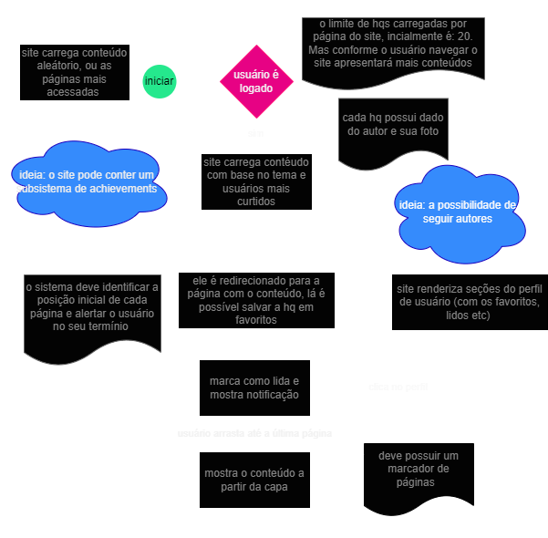

# Reading App with ***Next JS*** 📚📖

 
 Olá seja bem vindo, este é um projeto com o intuito de criar uma plataforma online de leitura, porém focado em histórias em quadrinhos, e mangás (histórias em quadrinhos japonesas). 

## As princípais funcionalidades da plataforma

<ul>
  <li>Apresentar conteúdo</li>
  <li>Pesquisar por:
    <ul>
      <li>categoria</li>
      <li>título</li>
    </ul>
  </li>
</ul>

Assim como outras operações CRUD.

## Diagrama referente a acessibilidade do usuário 👥

 
 

